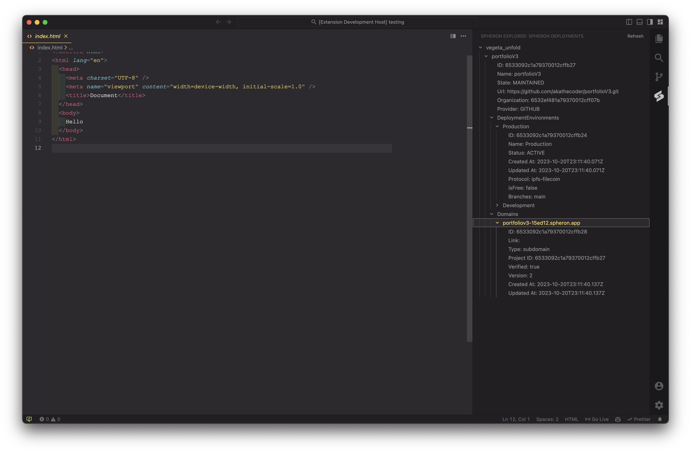
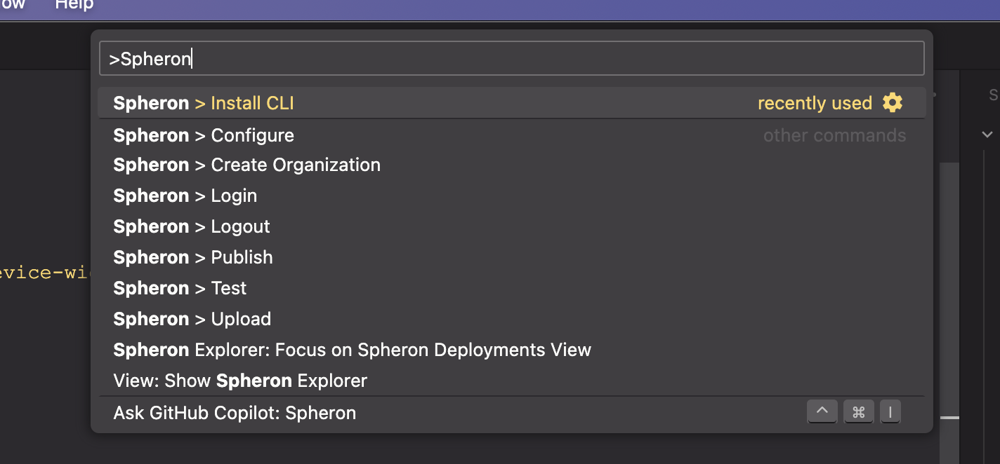

# Spheron Extension

This is a Visual Studio Code extension for working with the Spheron platform. It provides commands for installing the Spheron CLI, logging in to the Spheron platform, uploading files to the platform, and initializing a new Spheron project.

## Installation

To install the extension, follow these steps:

1. Open Visual Studio Code.
2. Open the Extensions view by clicking on the Extensions icon in the Activity Bar on the side of the window or by pressing `Ctrl+Shift+X`.
3. Search for "Spheron Extension".
4. Click the Install button next to the extension.
5. Reload Visual Studio Code when prompted.

## Usage

The extension provides the following features:

### Spheron Explorer

The Spheron Explorer is a custom view that displays a list of your Spheron deployments. To open the view, click on the Spheron icon in the Activity Bar on the side of the window.

#### Adding an API Key

To add your Spheron API key, follow these steps:

1. Open the Spheron Explorer.
2. Click on the **Add API Key** button.
3. Enter your API key in the input field.
4. Click **Enter**.

### Command View

The Command view displays a list of your Spheron deployments, along with their status and other information.

The extension provides the following commands:

- `Spheron Extension: Install`: Installs the Spheron CLI globally using npm.
- `Spheron Extension: Login`: Logs in to the Spheron platform using your credentials.
- `Spheron Extension: Upload`: Uploads the current file or folder to the Spheron platform.
- `Spheron Extension: Init`: Initializes a new Spheron project in the current workspace.
- and many more . . .

To use a command, open the Command Palette by pressing `Ctrl+Shift+P` (Windows, Linux) or `Cmd+Shift+P` (macOS), type the name of the command, and press Enter.

## License

This extension is licensed under the GNU GPLv3 License. See the [LICENSE](LICENSE) file for details.
